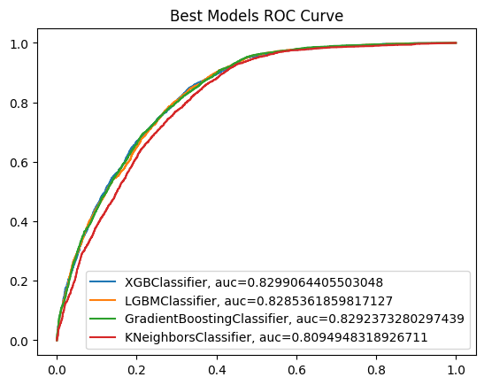
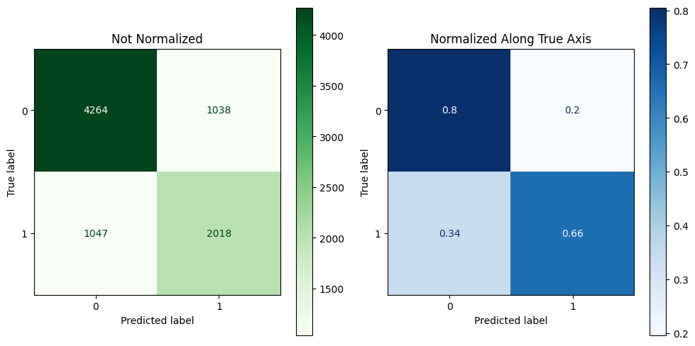

# Classification of Smoker Status using Bio-signals
Smoking has been proven to affect health in a multitude of ways negatively. Smoking has been found to harm nearly every organ of the body, cause many diseases, as well as reducing the life expectancy of smokers in general. As of 2018, smoking has been considered the leading cause of preventable morbidity and mortality in the world, continuing to plague the world's overall health.

According to a World Health Organization report, the number of deaths caused by smoking will reach 10 million by 2030.

Evidence-based treatment for assistance in smoking cessation has been proposed and promoted. however, only less than one-third of the participants could achieve the goal of abstinence. Many physicians found counseling for smoking cessation ineffective and time-consuming and did not routinely do so in daily practice. To overcome this problem, several factors have been proposed to identify smokers who had a better chance of quitting, including the level of nicotine dependence, exhaled carbon monoxide (CO) concentration, cigarette amount per day, the age at smoking initiation, previous quit attempts, marital status, emotional distress, temperament, and impulsivity scores, and the motivation to stop smoking. However, individual use of these factors for prediction could lead to conflicting results that were not straightforward enough for physicians and patients to interpret and apply. Providing a prediction model might be a favorable way to understand the chance of quitting smoking for each smoker. Health outcome prediction models have been developed using machine learning methods over recent years.

Scientists are working on predictive models with smoking status as the prediction target. Your task is to help them create a machine-learning model to identify the smoking status of an individual using bio-signals

### Presentation Material/s: 

[HERE](/assets/SmokerClassification.pdf)

## Data Definition

**Link to the data:**
[HERE](https://docs.google.com/spreadsheets/d/e/2PACX-1vScgQWdl1UmogQAzMJpOI4tbaZsN0Zsp2GQy4FV_XWdtKZUi1DsEfXKhGlPAd4JChuz8MqWE7zuVyLB/pub?gid=1259380212&single=true&output=csv)

This data contains a sample of bio-signals gathered from individuals who are either smokers or non-smokers..

### Dictionary

<table>
  <tr>
    <th>Attribute</th>
    <th>Description</th>
    <th>Possible Values</th>
  </tr>
  <tr>
    <td>age</td>
    <td>Age of the individual</td>
    <td>Continuous value (5-year gap)</td>
  </tr>
  <tr>
    <td>height(cm)</td>
    <td>Height in centimeters</td>
    <td>Continuous value</td>
  </tr>
  <tr>
    <td>weight(kg)</td>
    <td>Weight in kilograms</td>
    <td>Continuous value</td>
  </tr>
  <tr>
    <td>waist(cm)</td>
    <td>Waist circumference in centimeters</td>
    <td>Continuous value</td>
  </tr>
  <tr>
    <td>eyesight(left)</td>
    <td>Left eye eyesight measurement</td>
    <td>Continuous value</td>
  </tr>
  <tr>
    <td>eyesight(right)</td>
    <td>Right eye eyesight measurement</td>
    <td>Continuous value</td>
  </tr>
  <tr>
    <td>hearing(left)</td>
    <td>Left ear hearing assessment</td>
    <td>Discrete values (e.g., 1 for normal, 2 for impaired)</td>
  </tr>
  <tr>
    <td>hearing(right)</td>
    <td>Right ear hearing assessment</td>
    <td>Discrete values (e.g., 1 for normal, 2 for impaired)</td>
  </tr>
  <tr>
    <td>systolic</td>
    <td>Systolic blood pressure</td>
    <td>Continuous value</td>
  </tr>
  <tr>
    <td>relaxation</td>
    <td>Diastolic blood pressure (relaxation)</td>
    <td>Continuous value</td>
  </tr>
  <tr>
    <td>fasting blood sugar</td>
    <td>Fasting blood sugar level</td>
    <td>Continuous value</td>
  </tr>
  <tr>
    <td>Cholesterol</td>
    <td>Total cholesterol level</td>
    <td>Continuous value</td>
  </tr>
  <tr>
    <td>triglyceride</td>
    <td>Triglyceride level in the blood</td>
    <td>Continuous value</td>
  </tr>
  <tr>
    <td>HDL</td>
    <td>HDL cholesterol level</td>
    <td>Continuous value</td>
  </tr>
  <tr>
    <td>LDL</td>
    <td>LDL cholesterol level</td>
    <td>Continuous value</td>
  </tr>
  <tr>
    <td>hemoglobin</td>
    <td>Hemoglobin level in the blood</td>
    <td>Continuous value</td>
  </tr>
  <tr>
    <td>Urine protein</td>
    <td>Presence of urine protein</td>
    <td>Discrete values (e.g., 1 for presence, 0 for absence)</td>
  </tr>
  <tr>
    <td>serum creatinine</td>
    <td>Serum creatinine level</td>
    <td>Continuous value</td>
  </tr>
  <tr>
    <td>AST</td>
    <td>AST (glutamic oxaloacetic transaminase) level</td>
    <td>Continuous value</td>
  </tr>
  <tr>
    <td>ALT</td>
    <td>ALT (glutamic pyruvic transaminase) level</td>
    <td>Continuous value</td>
  </tr>
  <tr>
    <td>Gtp</td>
    <td>γ-GTP level</td>
    <td>Continuous value</td>
  </tr>
  <tr>
    <td>dental caries</td>
    <td>Presence of dental caries</td>
    <td>Discrete values (e.g., 1 for presence, 0 for absence)</td>
  </tr>
  <tr>
    <td>smoking</td>
    <td>Smoking status</td>
    <td>Discrete values (e.g., 1 for smoker, 0 for non-smoker)</td>
  </tr>
</table>

 

## Data Analysis

View the EDA [here](https://github.com/jpcanamaque/codingdojo-project2/blob/master/Project2_CodingDojo_SmokersBioSignal_EDA.ipynb)

### Exploratory Data Analysis (EDA)
- Our dataset is not balanced, as there are more non-smokers than smokers in the dataset. We need to consider this in creating our model as the balance is a vital factor in the performance of the model
- Majority of the columns not mentioned below are positively skewed, which suggests that most of the values are above the observed mode of the distribution.
- Column `hemoglobin` appears to be negatively skewed, which suggests that most of the values are falling below the observed mode of the distribution.
- Columns `waist`, `systolic`, and `cholesterol` appears to be a normally distributed column.
- Due to the majority of columns that are positively skewed, there might be a significant amount of outliers in the dataset.

### Correlation Heatmap

Based on the correlation above to the target value, the following is observed:

- `height`, `weight`, `waist`, `triglyceride`, `hemoglobin`, `serum_creatinine`, and `gtp` has a weak positive correlation to the smoking columns

Other notable correlations observed are the following:

- `ldl` to `cholesterol` has strong positive correlation
- `weight` to `waist` has strong positive correlation
- `height` to `weight` has moderate positive correlation
- `systolic` to `relaxation` has moderate positive correlation
- `alt` to `ast` has moderate positive correlation
- `hdl` to `triglyceride` has moderate negative correlation

### Explanatory Data Analysis

- Age groups from 35 to 60 are having an average of 200 cholesterol level.
- Majority of the age groups have higher cholesterol levels from non-smokers than the smokers
- There is no indicative correlation of cholesterol to smoking habits of a person based on this insight

## Model Design

Modeling notebook: [HERE](https://github.com/jpcanamaque/codingdojo-project2/blob/master/Project2_CodingDojo_SmokersBioSignal_ML.ipynb)

### Comparision of implemented models
|    Metrics           | KNeighbors | GradientBoosting | LightGBM | XGBoost
| ------------------------ | ----------------- | --------------------------- | --------------------------- | --------------------------- |
| Accuracy @ Train (in %) | 100 | 78 | 78.7 | **76.5** |
| Accuracy @ Test (in %) | 72.9 | 74.8 | 74.4 | **75.1** |
| F1 Score @ Train (in %) | 100   | 76.3 | 77.2 | **74.7** |
| F1 Score @ Test (in %)  | 70.2  | 72.9 | 72.5 | **73.5** |

\* All tuned measuring on ROC AUC

Based on the comparison of each metric used in measuring the models implemented, the XGBoost is the best model for classifying the smoker status using our data. It provided a better performance in terms of the Accuracy and F1 scores.

### Confision Matrix of the Best Model

## Summary and Recommendation
After analyzing the data and fitting the data to models, I recommend using the XGBoost as the main model for creating a classification model for this data. Since the recommended model is not yet fully tuned, there is still room for improvement in the model's performance.

